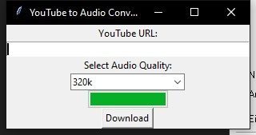

# YouTube to Audio Converter



This tool allows users to convert YouTube videos into MP3 files. It features a simple graphical user interface (GUI) that enables users to input the URL of the YouTube video, select the desired audio quality, and start the download and conversion process.

## Easy Installation (For Non-Technical Users)
1. Download the file [here](https://github.com/Ppaja/YouTubetoAudio/archive/refs/heads/main.zip) and extract it.
2. In the extracted folder, run "install.bat" to install the necessary requirements.
3. To start the tool, run "start.bat".

## Advanced Installation (For Experienced Users)
1. Clone the repository:

```
git clone https://github.com/Ppaja/YouTubetoAudio.git
```
2. Navigate to the project folder and install the requirements:

```
pip install -r requirements.txt
```
3. Start the tool by running `download.py` in Python:

```
cd YOUR_PROJECTFOLDER_PATH
python download.py
```

## How to Use
1. Enter a YouTube URL.
2. (Optional) Select the audio quality (128k, 256k, 320k).
3. Click "Download".


